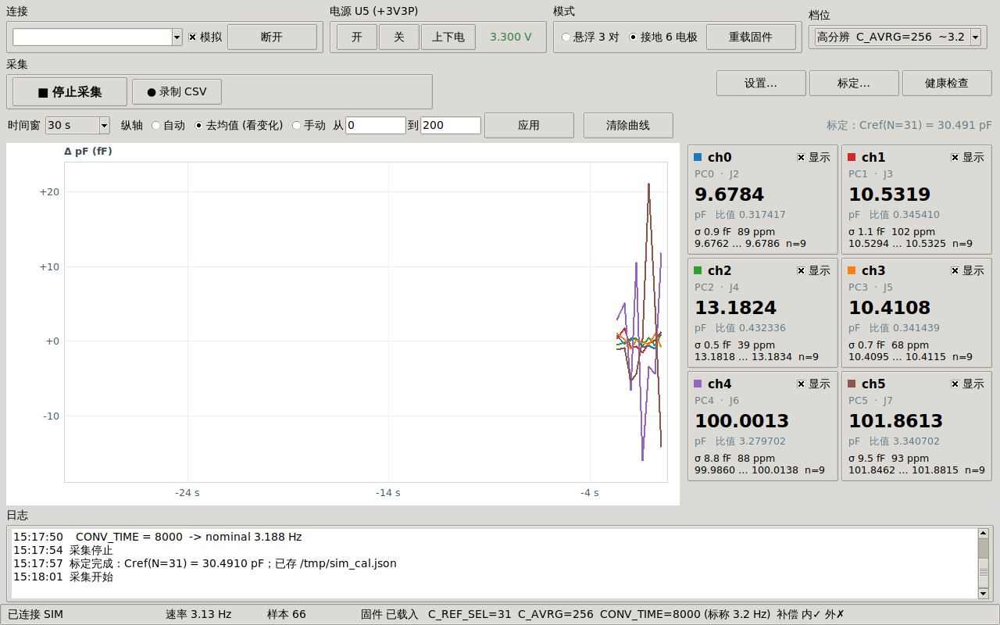

# PCAP04 3-Channel Capacitance Readout Board

Open-hardware capacitance-to-digital acquisition board built around the
[ScioSense PCAP04](https://www.sciosense.com/pcap04-capacitance-to-digital-converter/)
CDC and an STM32G0B1. Three floating channel pairs or six grounded electrodes,
brought out on SMA edge connectors, with a single USB-C cable for power,
console and firmware update.

Everything here has been built and measured on real hardware — the numbers in
this README are measurements from an assembled v1.5 board, not datasheet
copy.



---

## What it does

| | |
|---|---|
| Channels | 3 floating pairs (PC0/PC1, PC2/PC3, PC4/PC5) **or** 6 grounded electrodes |
| Range | ~385 pF to **1285 pF** full scale, depending on the on-chip reference setting |
| Resolution | sub-aF LSB; **noise floor 4–13 fF** rms depending on averaging and rate |
| Sample rate | 12.8 Hz default, up to **116 Hz** measured |
| Interface | USB-C CDC console (also UART on a header, in parallel) |
| Firmware update | USB DFU — no debug probe needed |
| Board | 100 × 100 mm, 4-layer, SMA edge connectors (C496550) |

Mode switching between floating and grounded takes ~30 ms at runtime; it does
not require re-uploading anything.

## Repository layout

```
hardware/       KiCad 7 project, custom footprints, 3D models
  manufacturing/  gerbers, drill, assembly data (JLCPCB-ready)
firmware/       bare-metal STM32G0B1 firmware (no vendor HAL)
  prebuilt/       pcap04_diag.bin, ready to flash
host/           Python library, CLI and GUI
  characterisation/  the sweeps that produced the numbers in docs/measurements.md
docs/           design verification report, usage guide, measured results
```

## Quick start

### 1. Get a board

`hardware/manufacturing/` contains gerbers, drill files and assembly data ready
to upload. The board is 100 × 100 mm 4-layer; the design rules file is
`hardware/*.kicad_dru`.

### 2. Flash the firmware

No debug probe required — the STM32's ROM bootloader speaks USB DFU, and the
flasher here is pure Python (pyusb, no `dfu-util`):

```bash
cd host
pip3 install -r requirements.txt
python3 pcapdfu.py write ../firmware/prebuilt/pcap04_diag.bin
python3 pcapdfu.py run
```

> A **factory-blank** STM32G0 enters DFU on its own. After the first flash it
> needs one physical unplug/replug of USB-C before it will run your firmware:
> `FLASH_ACR.EMPTY` is only re-evaluated at a power-on reset (RM0444 §2.5.4).
> After that, `python3 pcap.py console dfu` puts it back into DFU on demand.

To build from source you need `arm-none-eabi-gcc`:

```bash
cd firmware && make
```

### 3. Take a measurement

```bash
cd host
python3 pcap.py power on          # U5 load switch -> +3V3P
python3 pcap.py -m f read         # floating, 3 pairs
python3 pcap.py -m g read         # grounded, 6 electrodes
python3 pcap.py stream            # continuous, at the chip's own rate
python3 pcap.py log run.csv -t 60 # 60 s to CSV with running statistics
python3 pcap_gui.py               # graphical strip chart
```

`pcap_gui.py --sim` runs the whole GUI against a built-in simulator, so you can
try the interface before you have a board.

### 4. Calibrate

The chip reports a **ratio** `C / Cref`, so absolute picofarads need one known
capacitor:

```bash
python3 pcap.py calib 100 -c 2    # 100 pF fitted on channel 2
```

Result is stored and loaded automatically from then on.

---

## Things worth knowing before you build one

These cost real debugging time. All measured on the v1.5 board.

**Do not compute Cref from the datasheet formula.** The datasheet gives
`Cref ≈ 0.959·N + 3.23 pF`. This part measures `≈ 0.975·N + 9.91 pF` — the slope
is right to 1.7 % but there is ~7 pF of extra fixed parasitic, and the step
width varies 0.6–1.2 pF between codes (±4 % residual against an affine model).
Calibrate at the code you actually use.

**`DISCHARGE_TIME = 0` breaks real sensors.** The ScioSense reference config
ships with zero discharge time. That is fine for a C0G part on a short trace,
but any sensor with series resistance or a lossy dielectric cannot discharge in
zero time: the port reports `C_PortError` and the reading pins at full scale,
which looks exactly like a dead channel. This firmware defaults to 8. See
[docs/measurements.md](docs/measurements.md).

**`C_AVRG` must stay ≤ 256.** At 512 and above the reading goes ~19.5 % low
(2.4911 → 2.0042 on a 100 pF part). 256 and 257 are both clean, so it is not a
low-byte-zero effect — most likely accumulator saturation with large
capacitances. Firmware and host both clamp.

**A sensor referenced to ground is not a floating sensor.** A level probe
measuring against a tank wall is single-ended. In floating mode the chip
measures the *differential* capacitance between the two ports, and external
compensation deliberately removes each node's capacitance to ground — which is
exactly the signal. The same probe read 0.13 pF floating and 364 pF grounded,
with 36 ppm noise instead of 3800 ppm.

**Config writes need INIT + CDC_START.** Writing a config register alone leaves
the running conversion on the old setting. The first conversion after a restart
is usually garbage (often `0xFFFFFFFF`). The host library handles both.

**The PCAP04's firmware lives in volatile SRAM.** Its NVRAM ships blank, so the
548-byte DSP firmware is uploaded at every power-up. Any reset — a rail cycle or
its own watchdog — zeroes the config registers but **leaves the result
registers holding the previous conversion**, so a dead chip can hand back
plausible-looking stale data. The firmware verifies `RUNBIT` rather than
trusting a cached flag, and the host raises rather than returning stale values.

**Not populated on v1.5:** `PCAUX` (the guard driver output) and the
`PT0REF`/`PT1`/`PTOUT` resistance pins are unrouted, so the integrated guard
driver and external Pt temperature measurement cannot be used on this revision.
`RES6`/`RES7` still return numbers but are only useful as drift indicators.
Route these out if you respin.

---

## Documentation

- [docs/measurements.md](docs/measurements.md) — every measured figure, and how it was obtained
- [docs/usage.zh.md](docs/usage.zh.md) — full usage guide (Chinese)
- [docs/design-verification-report.pdf](docs/design-verification-report.pdf) — schematic and layout review against the datasheets

## Datasheets

Not redistributed here — they are the vendors' copyrighted documents. Download
from the source:

- PCAP04 — ScioSense
- STM32G0B1 datasheet and RM0444 reference manual — STMicroelectronics
- AN2606 (ROM bootloader) — STMicroelectronics
- TPS22918 load switch, TPS7A20 / TLV755P LDOs, SN74LV125A buffer — Texas Instruments
- USBLC6-2 ESD protection — STMicroelectronics

## Licensing

| Part | Licence |
|---|---|
| `hardware/` | [CERN-OHL-P-2.0](LICENSES/CERN-OHL-P-2.0.txt) |
| `firmware/`, `host/` | [MIT](LICENSES/MIT.txt) |
| `docs/` | [CC-BY-4.0](LICENSES/CC-BY-4.0.txt) |

### Third-party code

`firmware/pcap04_stdfw.h` contains the PCAP04 standard DSP firmware (548 bytes)
and its default configuration (52 bytes), extracted from the
[ScioSense PCAP04 sample code](https://github.com/sciosense/pcap04-sample-code),
which is MIT licensed, **Copyright © 2023 ScioSense**. That copyright notice is
reproduced in the header file. Everything else in `firmware/` is original.

## Contributing

Issues and pull requests welcome. If you build one, a note about what you
measured would be genuinely useful — especially Cref calibration on a different
chip, since the ~7 pF intercept offset documented above is a single-part result
and may or may not be typical.

## Disclaimer

This is a research instrument, published as-is with no warranty. It has been
verified on one assembled board by one person. Check it against your own
requirements before relying on it for anything that matters.
